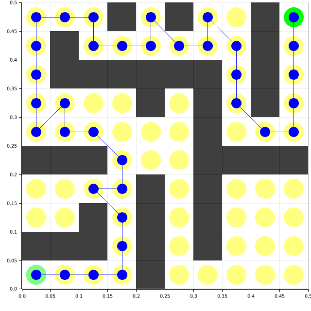
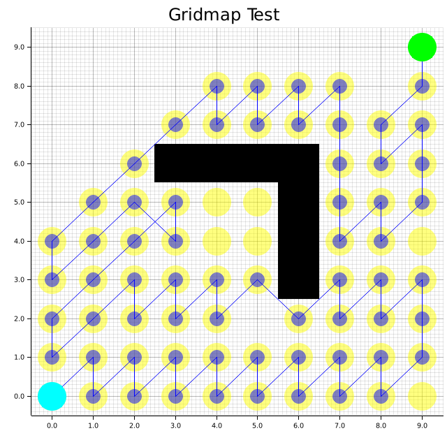
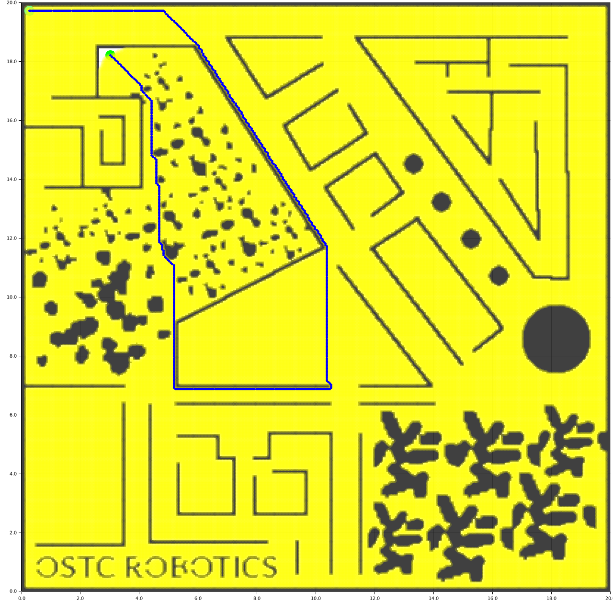
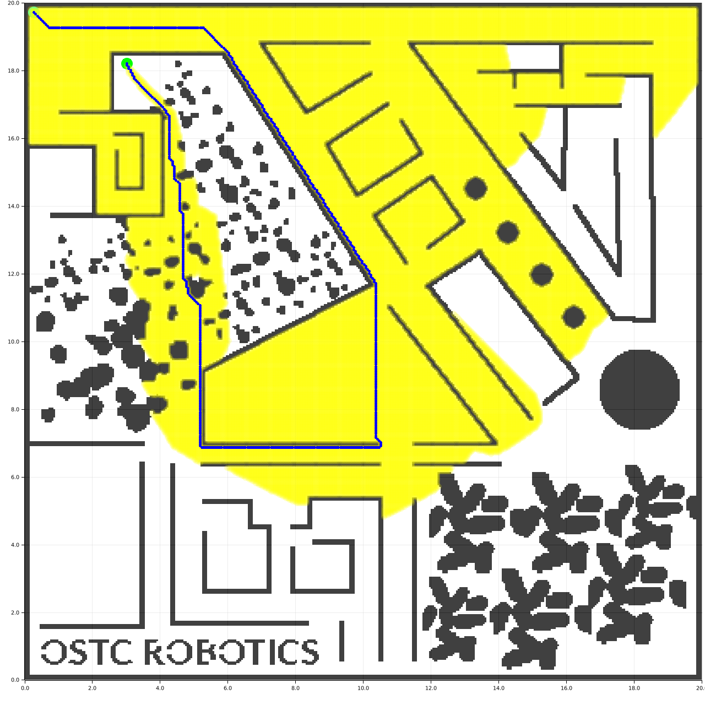

# Ruth Planner (WIP)
[Ru]st Pa[th] Planner aims to be a collection of search-based path planning algorithms written in Rust.
This crate aims to use minimal external dependencies, except for visualization purposes.

# Search-Based Algorithms

### Breadth-First Search


### Depth-First Search


### Dijkstra


### A*


# Testing
```rust 
cargo test --show-output
```

# Roadmap

1. Animation for motion planning
2. Robots with size and shapes

# License

The source code in this package is released under the Apache-2.0 License. For further details, see the [LICENSE](LICENSE) file.

# Acknowledgement

## Algorithms

1. Breadth-First Search

2. Depth-First Search 

3. Dijkstra

4. A Star

5. RRT
- [Sampling-based Algorithms for Optimal Motion Planning (Sertac Karaman, Emilio Frazzoli)](https://citeseerx.ist.psu.edu/viewdoc/download?doi=10.1.1.419.5503&rep=rep1&type=pdf)
- Python Robotics

6. D* 


## Test maps

The test maps in [test_maps/nav2_maps](test_maps/nav2_maps) were taken from the [ROS-Planning Nav2 Repository](https://github.com/ros-planning/navigation2)

