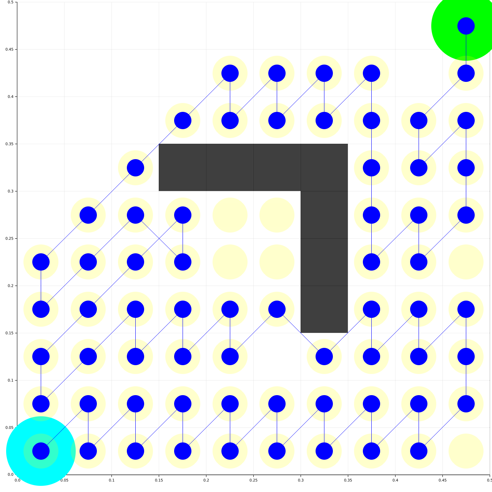
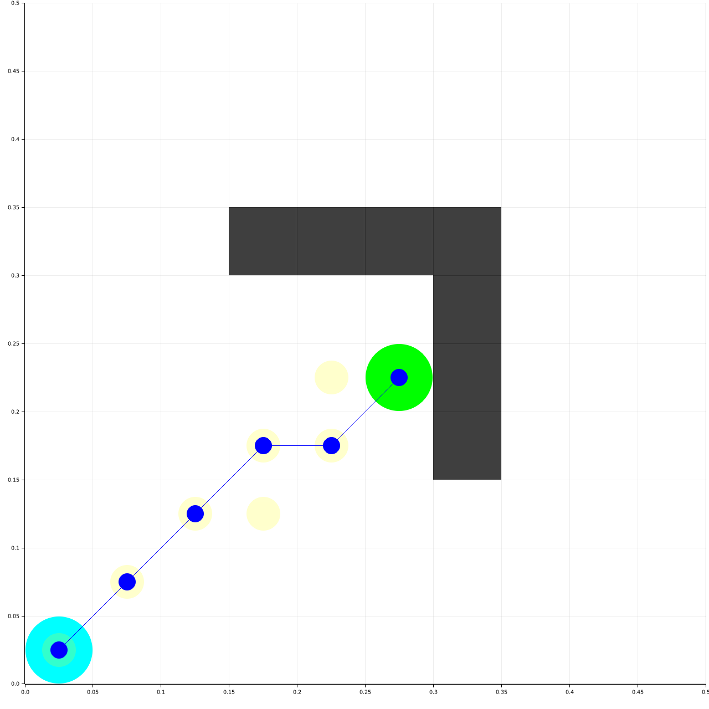

# Ruth Planner (WIP)
[Ru]st Pa[th] Planner aims to be a comprehensive collection of search-based path planning algorithms written in Rust.
This crate aims to use minimal external dependencies, except for visualization purposes.

## Implemented algorithms

### Breadth-First Search


### Depth-First Search


### Djikstra


### A*


## Roadmap
1. Implement other algorithms (ARA*, D* Lite, Theta*)

2. Optimize planners

3. Generate animations for the path search.

## Testing
```rust 
cargo test --show-output
```
